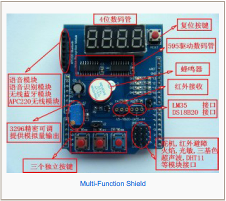
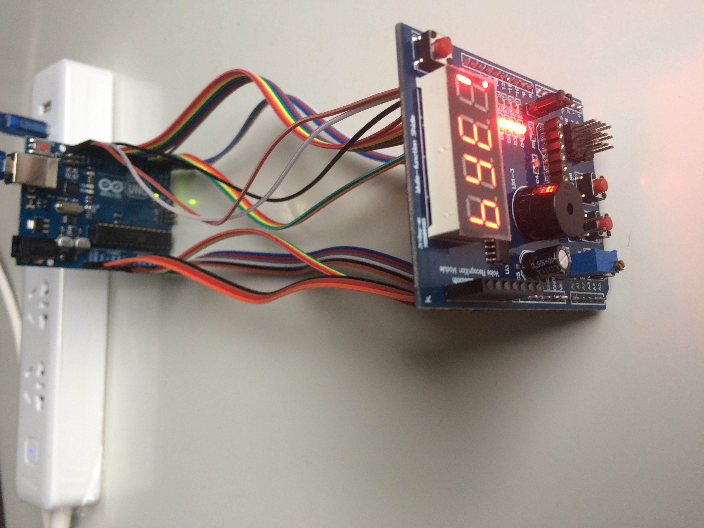
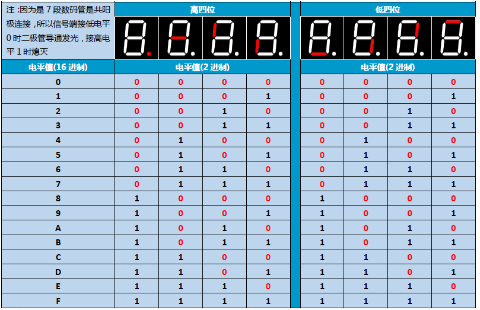

# countdownAndBoom

Hardware: Arduino UNO R3 + Multi function Shield  
Language: arduino

  

  

Instruction of 7-segment-LED on this shield:
  
Example: with code 0x89 shows a "H" (Upper 4 Bit: 8; lower 4 bit: 9; 0x means hexadecimal)
